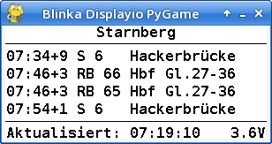
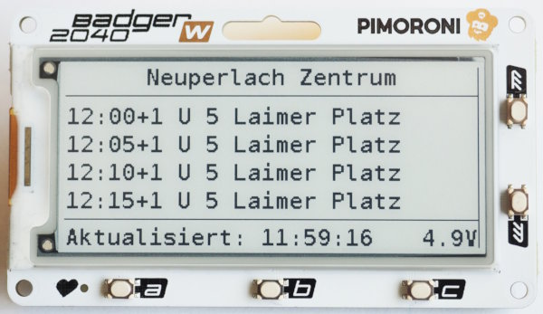
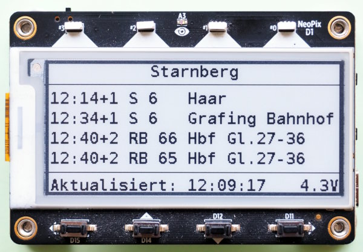

Departure-Monitor for Public Transportation in Germany
======================================================

This is a departure-monitor for German railway, bus and other stations. It
displays live-data (if available):

This repository provides a number of programs:

  - two simple commandline tools to query stations and departures
  - a program implemented in CircuitPython that runs on PC/laptops,
    Raspberry Pis (and similar SBCs) and microcontrollers

All programs are based on the REST-API from
<https://v6.db.transport.rest/api.html>.

Commandline Tools
-----------------

The commandline tools in the `tools`-subdirectory use CPython together
with the module `pyHaFAS` from <https://github.com/FahrplanDatenGarten/pyhafas>.
It is best to install `pyHaFAS` and it's dependencies within a
python virtual environment:

    python3 -m venv .venv_dp
    source .venv_dp/bin/activate
    pip3 install pyhafas
    cp -a tools/* .venv_cp/bin

Note that you cannot move the virtual environment *after* creating it, so
if you want to have it elsewhere, you have to repeat these steps again.

Usage
-----

Both commandline tools are very simple scripts without help or options.
They were developed as quick support tools for the GUI program (see below).

The tool `get_station.py` queries the API for station-IDs:

    (.venv_dp) > #get_station.py "Neu-Perlach Zentrum"     # same query!
    (.venv_dp) > get_station.py Neu-Perlach Zentrum
    624406: Neuperlach Zentrum, München
    8070912: Lehrte Neues Zentrum
    681863: Woffenbach Zentrum, Neumarkt i.d. Oberpfalz
    726943: Zentrum, Perleberg
    676376: Büchenbach Diakonisches Zentrum, Erlangen
    8578376: Neuhausen, Zentrum
    636926: Neues Zentrum, Lehrte
    622397: Neuherberg Helmholtz-Zentrum, Oberschleißheim
    704886: Neurologisches Zentrum, Bad Segeberg
    720024: Zentrum, Graben-Neudorf

In this example `(.venv_dp)` is part of the shell-prompt, this may
be different on your system.

The search is fuzzy and returns a list of possible matches. Usually the
first match is the one that you want/need. Sometimes there are multiple
IDs for the same location (e.g. for main stations). Here you have to
experiment and test which one is the best for your needs.

The IDs are needed to query departures with `departures.py`:

    (.venv_dp) > departures.py 624406 'subway' 638169
    07:20+1 U 5 Laimer Platz
    07:40+1 U 5 Laimer Platz
    08:00+1 U 5 Laimer Platz
    ...

The parameters are as follows:

  1. The station ID of start (required)
  2. The so called "product", the type of transportation.\
     Use `'*'` to include all products (optional)
  3. Station ID of direction (optional)

MCU with CircuitPython
----------------------

The departure monitor also runs on a microcontroller with attached display.
Currently, the support for these devices is already implemented:

  - Pimoroni Badger2040W\
    
  - Adafruit MagTag\
    

Porting to other devices/hardware is simple. For an instruction, see
below.

To install the software, the following steps are necessary:

  1. Install the current version of CircuitPython on the device
  2. Copy all files *below* `src/` to the `CIRCUITPY`-drive
  3. Install circup: `pip3 install circup`
  4. Run `circup --path=path-to-your device install -r requirements.txt`
  5. Add a file `settings.py` to your `CIRCUITPY`-drive
     (see section 'Configuration' below)

PC/Laptop/Raspi with CircuitPython
----------------------------------

Installation and usage for normal systems is a bit more complicated,
mainly because the graphical environment is not up to the latest
standard.

The following commands install the environment (you can reuse the
virtual environment from the commandline tools, i.e. skip the first command):

    python3 -m venv .venv_dp/
    source .venv_dp/bin/activate

    pip3 install blinka-displayio-pygamedisplay \
                 adafruit-circuitpython-display-text \
                 adafruit-circuitpython-bitmap-font \
                 adafruit-circuitpython-display-shapes \
                 json-stream

    cp -a misc/vectorio .venv_dp/lib/python*/site-packages

To start the departure monitor, use these commands:

    source .venv_dp/bin/activate   # if not already done
    cd src
    python3 ./main.py

Configuration
-------------

The application needs a configuration file `settings.py`. This file is
*not* maintained in the repository since it is specific to the user
environment.

 The `settings.py`-file configures

  - network credentials (WLAN-SSID, password)
  - hardware (if not board-specific, see below)
  - UI-attributes (if different to the defaults in `ui_settings.py`)
  - application settings (stations and so on)

The project provides a sample settings-file in `src/settings_template.py`.
Copy this file to `src/settings.py` and adapt it to your specific situation.

The settings-file allows to configure multiple departure stations. Using
the left/right keys you can scroll through the stations. The up/down-keys
will scroll back and forth within time.

*Note that the Badger2040W only allows for two stations due to memory
constrains!*

Porting to other devices
------------------------

From a hardware perspective, the application uses a display and a number
of buttons. The latter are *not* strictly necessary, but without
buttons you are limited to a single departure station and the display
will only show as many departures from now that fit on the display.

To port the program to a different device and/or hardware combination,
you need to define the hardware of the MCU development board, the display
and the buttons:

  - create a file `src/hal/<board.board_id>.py` with board-specific
    implementations and/or
  - add relevant functions for the display and keys to `settings.py`

To lookup `board.board_id`, start the REPL and run:

    import board
    print(board.board_id)

Use one of the existing files in `src/hal` as a blueprint for your board.

You should define hardware that is not hard-wired to the dev-board
in `settings.py`.

As an example, consider a normal Pico-W with an attached SPI-display and
some buttons wired to various GPIO-pins.

In this case, the hal-file would be `src/hal/raspberry_pi_pico_w.py`.
Since this board does not define any specific hardware, the hal-file
is actually not necessary since the system will use sensible defaults
if it does not find a specific hal-file.

In this example, the definition of the display and the keys has to be
in `settings.py`, e.g.:

    hw_config = Settings()

    def _get_display():
      import board
      import displayio
      import busio
      from adafruit_st7735r import ST7735R
      displayio.release_displays()
      spi = busio.SPI(clock=board.GP10,MOSI=board.GP11)
      bus = displayio.FourWire(spi,command=board.GP8,chip_select=board.GP9,
                               reset=board.GP12)
      return ST7735R(bus,width=180,height=80,
                              colstart=28,rowstart=0,invert=True,
                              rotation=90,bgr=True)

    def _get_keys():
      """ return list of pin-numbers for up, down, left, right """
      # format is (active-state,[up,down,left,right])
      return (False,[board.GP2,board.GP18,board.GP16,board.GP20])

    hw_config.DISPLAY     = _get_display
    hw_config.get_keys    = _get_keys
